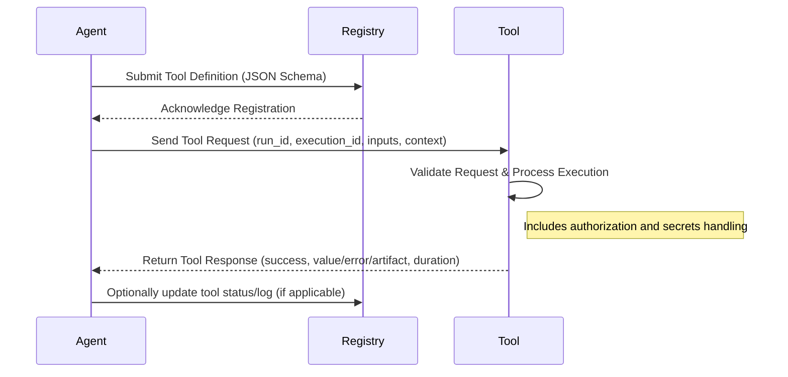

# RFC: Open Tool Calling Standard

**Status:** Draft

## Abstract

This document specifies the Open Tool Calling Standard, a comprehensive communication layer for agents calling tools. It defines the structures and protocols used to describe tools, initiate tool calls, and process responses. The standard is based on a set of JSON schemas that govern tool definitions, tool requests, and tool responses. It aims to provide a unified, extensible, and interoperable framework for agent-to-tool interactions.

---

## Table of Contents

1. [Introduction](#introduction)
2. [Terminology](#terminology)
3. [Architecture Overview](#architecture-overview)
4. [Schema Definitions](#schema-definitions)
   - [Tool Definition Schema](#tool-definition-schema)
   - [Tool Request Schema](#tool-request-schema)
   - [Tool Response Schema](#tool-response-schema)
5. [Communication Flow](#communication-flow)
6. [Security and Authorization](#security-and-authorization)
7. [Extensibility and Versioning](#extensibility-and-versioning)
8. [Conclusion](#conclusion)
9. [References](#references)

---

## 1. Introduction

The Open Tool Calling Standard establishes a set of protocols and formats to facilitate communication between agents (clients) and tools (services) in distributed systems. It ensures that tool definitions, requests, and responses adhere to a structured and open standard. This RFC presents detailed JSON schema specifications that serve as the backbone for this standard, enabling uniform interpretation and execution of tool interactions.

---

## 2. Terminology

- **Agent:** An entity that issues requests to tools for performing specific tasks.
- **Tool:** A service or function that can be invoked by an agent using the defined protocols.
- **Schema:** A formal description of the data structure, typically expressed in JSON Schema, used to validate data formats.
- **RFC:** Request for Comments; a document that describes methods, behaviors, research, or innovations applicable to the Internet.
- **Toolkit:** A collection of tools grouped under a common framework and versioned accordingly.
- **JSON Schema:** A vocabulary that allows you to annotate and validate JSON documents.

---

## 3. Architecture Overview

The Open Tool Calling Standard is designed around three key components:

1. **Tool Definition:** A schema that specifies how a tool is described. It includes metadata such as the tool's name, fully qualified name, toolkit information, and the input/output specifications.
2. **Tool Request:** A schema that details the structure of a tool call. It encompasses the run identifier, execution context, tool metadata, and input parameters.
3. **Tool Response:** A schema that outlines the structure of the response returned after a tool execution. It provides details on execution status, duration, and the actual output (or errors) of the tool call.

These components ensure consistent communication between agents and tools, regardless of the implementation details of each tool.

---

## 4. Schema Definitions

### 4.1 Tool Definition Schema

The Tool Definition Schema establishes the properties and required fields to describe a tool. It consists of the following sections:

- **Metadata:**

  - **`$schema`**: URI defining the JSON Schema version.
  - **`name`**: A human-readable name for the tool.
  - **`fully_qualified_name`**: A unique identifier for the tool.
  - **`description`**: A human-readable explanation of the tool's purpose.

- **Toolkit Information:**

  - **`toolkit`**: Contains the toolkit’s name, description, and version.

- **Input Schema:**

  - **`input`**: Describes the parameters accepted by the tool.
    - Each parameter includes:
      - **`name`**: Parameter name.
      - **`required`**: Boolean indicating whether the parameter is mandatory.
      - **`description`**: Explanation of the parameter.
      - **`value_schema`**: Data type and structure details (including support for arrays with inner type definitions).
      - **`inferrable`**: (Optional) Indicates if the value can be inferred automatically.

- **Output Schema:**

  - **`output`**: Specifies the expected result of the tool execution.
    - **`available_modes`**: A list of modes such as `value`, `error`, `artifact`, etc.
    - **`description`**: Human-readable explanation of the output.
    - **`value_schema`**: Defines the data type and structure of the output value.

- **Requirements:**
  - **`requirements`**: Describes authorization or secret requirements.
    - **`secrets`**: Array of secret definitions.
    - **`authorization`**: Specifies required authorization methods (e.g., token-based).

The complete JSON Schema ensures that every tool adheres to a well-defined structure, facilitating consistent tool registration and discovery.

---

### 4.2 Tool Request Schema

The Tool Request Schema is designed to encapsulate the details of a tool invocation:

- **Run and Execution Identification:**

  - **`run_id`**: Globally unique identifier for the overall run.
  - **`execution_id`**: Unique identifier for the specific tool execution.
  - **`created_at`**: Timestamp indicating when the request was created.

- **Tool Metadata:**

  - **`tool`**: Contains the tool's name, the toolkit to which it belongs, and the toolkit version.

- **Input Parameters:**

  - **`inputs`**: An object containing the parameters needed by the tool. This field supports additional properties to accommodate various tool-specific inputs.

- **Context:**
  - **`context`**: Provides additional execution context including:
    - **`authorization`**: Contains tokens for authentication.
    - **`secrets`**: Secret information required for execution.
    - **`user_id`**: Unique user identifier.
    - **`user_info`**: Supplementary information provided by the authorization server.

This schema guarantees that every tool call is uniquely identifiable and that the necessary parameters and context for execution are clearly provided.

---

### 4.3 Tool Response Schema

The Tool Response Schema defines the structure of the data returned after a tool execution:

- **Execution Metadata:**

  - **`execution_id`**: The globally unique execution identifier.
  - **`duration`**: Execution time in milliseconds.
  - **`finished_at`**: Timestamp marking the completion of the execution.
  - **`success`**: Boolean flag indicating the success or failure of the execution.

- **Output Content:**
  The output can take one of several forms:
  1. **Value Response:**
     - Contains a `value` field that may be a JSON object, number, string, or boolean.
  2. **Error Response:**
     - Contains an `error` object with:
       - **`message`**: A user-facing error message.
       - **`developer_message`**: Detailed error information for internal debugging.
       - **`can_retry`**: Indicates if the request is retryable.
       - **`additional_prompt_content`**: Extra content to be used for retry prompts.
       - **`retry_after_ms`**: Suggested delay before retrying.
  3. **Authorization Response:**
     - Contains a `requires_authorization` object detailing:
       - **`id`**: Identifier for tracking authorization status.
       - **`url`**: Redirect URL for obtaining authorization.
       - **`scopes`**: Array of authorization scopes required.
       - **`status`**: Current authorization status.
  4. **Artifact Response:**
     - Contains an `artifact` object describing:
       - **`url`**: Location of the stored artifact.
       - **`content_type`**: MIME type of the artifact.
       - **`size`**: Size of the artifact in bytes.
       - **`meta`**: Metadata including a human-readable description.

The Tool Response Schema ensures that every response provides clear and actionable information regarding the outcome of the tool call.

---

## 5. Communication Flow

1. **Tool Registration:**

   - Tools register themselves using the Tool Definition Schema.
   - Registries use this information for tool discovery and client-side validation.

2. **Invocation:**

   - An agent creates a tool request following the Tool Request Schema.
   - The request includes necessary input parameters, context, and unique identifiers for tracking.

3. **Execution:**

   - The tool processes the request based on its implementation and the provided schema.
   - Execution metrics such as duration and timestamps are recorded.

4. **Response:**
   - Upon completion, the tool returns a response conforming to the Tool Response Schema.
   - The response provides either a successful output, an error, authorization instructions, or artifact information.

---

## 6. Security and Authorization

Security is a critical component of the Open Tool Calling Standard. The following measures are incorporated:

- **Authorization:**
  Tools may require token-based or other forms of authorization, as specified in the `requirements.authorization` field of the Tool Definition Schema.
- **Secrets Management:**
  Sensitive information is handled via the `requirements.secrets` field.
- **Contextual Security:**
  The Tool Request Schema includes contextual information such as user identity and authorization tokens, which help ensure secure execution.

These security measures are intended to protect the integrity of tool interactions and ensure that only authorized agents can invoke tool functions.

---

## 7. Extensibility and Versioning

- **Extensibility:**
  The Open Tool Calling Standard is designed to be extensible.

  - New parameters or response types can be added as additional properties in the respective schemas.
  - The use of JSON Schema allows for backward-compatible extensions.

- **Versioning:**
  - Each toolkit and tool definition must include a version identifier.
  - The `$schema` field in each schema helps ensure that both agents and tools are interpreting data according to the correct schema version.

Proper versioning guarantees that changes to the standard do not disrupt existing implementations.

---

## 8. Conclusion

The Open Tool Calling Standard provides a robust framework for agent-to-tool communications. By standardizing tool definitions, request formats, and response structures, this standard promotes interoperability, consistency, and security in distributed systems. Adoption of this standard will facilitate seamless integration between diverse agents and tools across multiple platforms.

---

## 9. References

- JSON Schema Validation Specification, [http://json-schema.org](http://json-schema.org)
