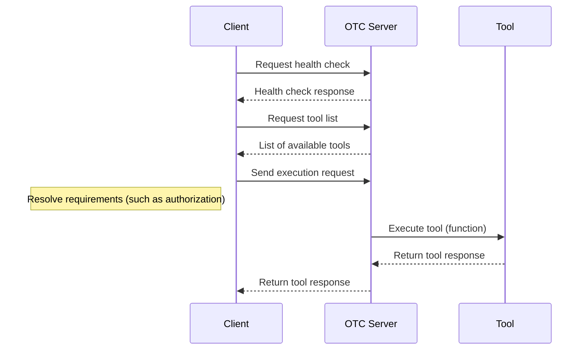

# RFC: Open Tool Calling Standard

**Status:** Draft

## Abstract

This document specifies the Open Tool Calling (OTC) standard, a comprehensive communication protocol for AI agents (clients) calling tools. It defines the structures and protocols used to describe tools, initiate tool calls, and process responses. The standard is comprised of JSON and OpenAPI schemas that govern tool definitions, tool requests, and tool responses. It aims to provide a unified, extensible, and interoperable framework for client-to-tool interactions.

## Editors

- Nate Barbettini ([@nbarbettini](https://github.com/nbarbettini))
- Eugene Yurtsev ([@eyurtsev](https://github.com/eyurtsev))
- Sam Partee ([@spartee](https://github.com/spartee))

---

## Table of Contents

1. [Introduction](#1-introduction)
2. [Terminology](#2-terminology)
3. [Architecture Overview](#3-architecture-overview)
4. [Schema Definitions](#4-schema-definitions)
   - [Tool Definition Schema](#41-tool-definition-schema)
   - [Tool Request Schema](#42-tool-request-schema)
   - [Tool Response Schema](#43-tool-response-schema)
5. [Communication Flows](#5-communication-flows)
6. [Security and Authorization](#6-security-and-authorization)
7. [Extensibility and Versioning](#7-extensibility-and-versioning)
8. [Conclusion](#8-conclusion)
9. [References](#9-references)

---

## 1. Introduction

The Open Tool Calling standard establishes a set of protocols and formats to facilitate communication between agents (clients) and tools (functions or services) in distributed systems. It ensures that tool definitions, requests, and responses adhere to a structured and open standard. This RFC presents detailed JSON and OpenAPI schema specifications that serve as the backbone for this standard, enabling uniform interpretation and execution of tool interactions.

## 2. Terminology

- **Client:** An entity that issues requests to tools for performing specific tasks.
- **Tool:** A service or function that can be executed (called) by a client using the defined protocols.
- **Schema:** A formal description of the data structure, typically expressed in JSON Schema, used to validate data formats.
- **Toolkit:** A collection of tools grouped under a common framework and versioned accordingly.
- **JSON Schema:** A vocabulary that allows you to annotate and validate JSON documents.

## 3. Architecture Overview

The Open Tool Calling standard is designed around three key components:

1. **Tool Definition:** A schema that specifies how a tool is described. It includes metadata such as the tool's name, unique identifier, toolkit information, and the input/output specifications.
2. **Tool Request:** A schema that details the structure of a tool call. It encompasses the run identifier, execution context, tool metadata, and input parameters.
3. **Tool Response:** A schema that outlines the structure of the response returned after a tool execution. It provides details on execution status, duration, and the actual output (or errors) of the tool call.

These components ensure consistent communication between clients and tools, regardless of the implementation details of each tool.



## 4. Schema Definitions

TODO: Add toolkit information, including a description of `version` (semver). Consider splitting `toolkit` into its own schema which is referenced from `ToolDefinition`.

### 4.1 Tool Definition Schema

The Tool Definition Schema establishes the properties and required fields to describe a tool. It consists of the following sections:

#### Metadata

- **`id`**: A unique identifier for the tool, in the following format: `ToolkitName.ToolName@Version`. For example, `MyToolkit.MyTool@1.0.0`.
- **`name`**: A human-readable name for the tool. For example, 'MyTool'.
- **`description`**: A human-readable explanation of the tool's purpose. This field can be used by both humans and AI models.

#### Toolkit Information

- **`toolkit`**: Contains the toolkit's name, description, and version.

#### Input Schema

**`input`**: Describes the input parameters for the tool.

- **`parameters`**: A JSON Schema object that describes the input parameters for the tool.
- **`non_inferrable_parameters`** (optional): A list of parameter names that MUST NOT be inferred by a model. If this array is empty, it is assumed that all parameters are inferrable.

`non_inferrable_parameters` allows tool developers to "hide" certain parameters from an AI model. For example, a tool that has an `is_admin` parameter can indicate that this parameter is required but that a model should not be trusted to infer its value. In this case, the client is still responsible for passing the parameter.

#### Output Schema

- **`output`** (optional): Specifies the expected result of the tool execution.

  - **`available_modes`**: A list of one or more possible output modes: `value`, `error`, `null`.
    - **`value`**: The tool may return a value. If this mode is present, the `value` field MUST be present.
    - **`error`**: The tool may return an error.
    - **`null`**: The tool may return no value.
  - **`description`** (optional): Human-readable explanation of the output.
  - **`value`** (optional): A JSON Schema object that describes the output parameters for the tool.

#### Requirements

**`requirements`** (optional): Describes any requirements or prerequisites needed for the tool to execute (e.g. authorization, secrets, etc.)

The `requirements` field describes tool requirements that are not strictly input parameters, such as the API key needed to call a target API. If the `requirements` field is not present, the client must assume that the tool can be executed without passing any additional information.

**`requirements.authorization`** (optional): Declares one or more required authorization methods.

Each required authorization method is described as an object with the following properties:

- **`id`**: A unique identifier for the authorization method or authorization provider.
- **`oauth2`** (optional): For tools that require OAuth 2.0-based authorization, this field contains the OAuth 2.0-specific authorization details.
  - **`scopes`**: A list of scopes that must be granted for the tool to execute properly.

**`requirements.secrets`** (optional): Declares one or more secrets that are required for the tool to execute.

Each required secret is described as an object with the following properties:

- **`id`**: A unique identifier for the secret.

#### Non-Normative Examples

TODO

### 4.2 Tool Request Schema

The Tool Request Schema is designed to encapsulate the details of a tool execution (tool call):

- **Run and Execution Identification:**

  - **`execution_id`**: Globally unique identifier for this tool execution.
  - **`trace_id`** (optional): Unique identifier for the trace of the tool execution, if supplied by the client.

- **Tool Metadata:**

  - **`tool_id`**: The unique identifier of the tool to call.

- **Input Parameters:**

  - **`inputs`**: An unconstrained object containing the parameters needed by the tool.

- **Context:**
  - **`context`**: Provides additional execution context including:
    - **`authorization`** (optional): Contains tokens for authentication.
    - **`secrets`** (optional): Secret information required for execution.
    - **`user_id`** (optional): Unique user identifier.
    - **`user_info`** (optional): Supplementary information provided by the authorization server.

This schema guarantees that every tool call is uniquely identifiable and that the necessary parameters and context for execution are clearly provided.

#### Tool Version Resolution

TODO - describe how the server will resolve the version of the tool to call, including the special keyword `latest` and the behavior when a version is not specified (also `latest`).

#### Non-Normative Examples

TODO

### 4.3 Tool Response Schema

The Tool Response Schema defines the structure of the data returned after a tool execution:

- **Execution Metadata:**

  - **`execution_id`**: The globally unique execution identifier.
  - **`success`**: Boolean flag indicating the success or failure of the execution.
  - **`duration`** (optional): Execution time in milliseconds.

- **Output Content:**
  The output can take one of several forms:
  1. **Value Response:**
     - Contains a `value` field that may be a JSON object, number, string, or boolean.
  2. **Error Response:**
     - Contains an `error` object with:
       - **`message`**: A user-facing error message.
       - **`developer_message`** (optional): Detailed error information for internal debugging.
       - **`can_retry`** (optional): Indicates if the request can be retried by the client. If unspecified, the client MUST assume the request cannot be retried (`false`).
       - **`additional_prompt_content`** (optional): Extra content to be used for retry prompts.
       - **`retry_after_ms`** (optional): Suggested delay before retrying.

The Tool Response Schema ensures that every response provides clear and actionable information regarding the outcome of the tool call.

#### Non-Normative Examples

TODO

## 5. Communication Flows

The Open Tool Calling (OTC) standard defines clear communication flows that enable clients to discover available tools and execute them. The flows below follow the definitions in the OpenAPI specification (`specification/http/1.0/openapi.json`), ensuring that all tool interactions are consistent, secure, and standardized.

### 5.1 Server Health Check

An OTC server MUST implement a health check endpoint that returns a 200 OK response if the server is healthy.

#### Flow Details:

- **Request:**
  - **Method:** GET
  - **Endpoint:** `/health`
- **Response:**
  - **Status Code:** 200 OK

### 5.2 Tool Discovery

Clients retrieve tool definitions from the OTC server using the `/tools` endpoint. This flow provides a catalog of tools that clients can use, all of which conform to the `ToolDefinition` schema.

#### Flow Details:

- **Request:**
  - **Method:** GET
  - **Endpoint:** `/tools`
  - **Security:** Servers MAY require bearer authentication (JWT). Servers that are internet-facing SHOULD require authentication.
- **Response:**
  - **Status Code:** 200 OK
  - **Content:** A JSON object that includes a `$schema` URI reference (indicating the standard version) and a `tools` array. Each element in the array is a complete tool definition.

#### Non-Normative Example: Tool Discovery

**Request:**

```http
GET /tools HTTP/1.1
Host: api.example.com
Authorization: Bearer <JWT token>
```

**Response:**

```json
{
  "$schema": "https://github.com/ArcadeAI/OpenToolCalling/tree/main/specification/http/1.0/openapi.json",
  "tools": [
    {
      "id": "Calculator.Add@1.0.0",
      "name": "Add",
      "description": "Add two numbers together",
      "toolkit": {
        "name": "Calculator",
        "description": "A toolkit for performing calculations.",
        "version": "1.0.0"
      },
      "input": {
        "parameters": {
          "type": "object",
          "properties": {
            "a": {
              "type": "number",
              "description": "The first number to add."
            },
            "b": {
              "type": "number",
              "description": "The second number to add."
            }
          }
        },
        "required": ["a", "b"]
      },
      "output": {
        "available_modes": ["value", "error"],
        "description": "The result produced by the tool.",
        "value": {
          "parameters": {
            "type": "object",
            "properties": {
              "result": {
                "type": "number",
                "description": "The sum of the two numbers."
              }
            }
          }
        }
      }
    }
  ]
}
```

### 5.2 Tool Execution

Tool execution is initiated by sending a POST request to the `/execute` endpoint. This flow lets clients run a tool and receive its output, with the request and response bodies conforming to the `ExecuteToolRequest` and `ExecuteToolResponse` schemas.

#### Flow Details:

- **Request:**
  - **Method:** POST
  - **Endpoint:** `/execute`
  - **Security:** Servers MAY require bearer authentication (JWT). Servers that are internet-facing SHOULD require authentication.
  - **Payload:** A JSON document with two main parts:
    - **`$schema` Field** (optional): A URI reference to the version of the Open Tool Calling standard that was used to generate the request.
    - **`request` Object:** Includes:
      - **`execution_id`** (required): A unique identifier for this execution.
      - **`tool_id`** (required): The unique identifier of the tool to be executed.
      - **`input`** (optional): An object providing the necessary input parameters.
      - **`context`** (optional): An object containing authorization tokens, secrets (if any), and user-specific data.
- **Response:**
  - **Status Code:** 200 OK
  - **Content:** A JSON document following the `ExecuteToolResponse` schema, which includes:
    - **`execution_id`** (required): Echoes the unique identifier from the request.
    - **`success`** (required): A Boolean indicating execution success.
    - **`duration`** (optional): The time taken for execution (in milliseconds).
    - **`output`** (optional): For tools that return a value, this field contains the value. For tools that return an error, this field contains an `error` object.

TODO: $schema is not required for the request, but is recommended to ensure compatibility with future versions of the standard. The server must assume the request conforms to the latest version of the standard if `$schema` is not present.

#### Non-Normative Example: Tool Execution

**Request:**

```http
POST /execute HTTP/1.1
Host: api.example.com
Content-Type: application/json
Authorization: Bearer <JWT token>

{
  "$schema": "https://github.com/ArcadeAI/OpenToolCalling/tree/main/specification/http/1.0/openapi.json",
  "request": {
    "execution_id": "123e4567-e89b-12d3-a456-426614174000",
    "tool_id": "Calculator.Add@1.0.0",
    "input": {
      "a": 1,
      "b": 2
    }
  }
}
```

**Response (Successful Execution):**

```json
{
  "$schema": "https://github.com/ArcadeAI/OpenToolCalling/tree/main/specification/http/1.0/openapi.json",
  "execution_id": "123e4567-e89b-12d3-a456-426614174000",
  "duration": 2,
  "success": true,
  "output": {
    "value": 3
  }
}
```

**Response (Error Case):**

```json
{
  "$schema": "https://github.com/ArcadeAI/OpenToolCalling/tree/main/specification/http/1.0/openapi.json",
  "execution_id": "123e4567-e89b-12d3-a456-426614174000",
  "success": false,
  "output": {
    "error": {
      "message": "Invalid input parameter",
      "developer_message": "Parameter 'b' is missing or formatted incorrectly.",
      "can_retry": false
    }
  }
}
```

## 6. Security and Authorization

Security is a critical component of the Open Tool Calling standard. The following measures are incorporated:

- **Authorization:**
  Tools may require token-based or other forms of authorization, as specified in the `requirements.authorization` field of the Tool Definition Schema.
- **Secrets Management:**
  Sensitive information such as API keys, passwords, and other credentials is handled via the `requirements.secrets` field.
- **Contextual Security:**
  The Tool Request Schema includes contextual information such as user identity and authorization tokens, which help ensure secure execution.

These security measures are intended to protect the integrity of tool interactions and ensure that only authorized clients can execute tools.

TODO describe client->server security.

## 7. Extensibility and Versioning

- **Extensibility:**
  The Open Tool Calling standard is designed to be extensible.

  - New parameters or response types can be added as additional properties in the respective schemas.
  - The use of JSON-Schema allows for backward-compatible extensions.

- **Versioning:**
  - Each server response must include a `$schema` field that references the version of the Open Tool Calling standard that was used to generate the response.

Proper versioning guarantees that changes to the standard do not disrupt existing implementations.

## 8. Conclusion

The Open Tool Calling standard provides a robust framework for client-to-tool communications. By standardizing tool definitions, request formats, and response structures, this standard promotes interoperability, consistency, and security in distributed systems. Adoption of this standard will facilitate seamless integration between diverse clients and tools across multiple platforms.

## 9. References

- JSON Schema Validation Specification, [http://json-schema.org](http://json-schema.org)
