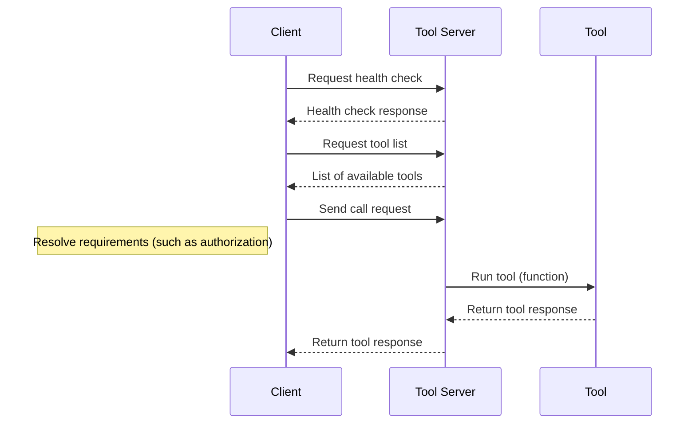

# RFC: Open Tool Calling Standard

**Status:** Draft

## Abstract

This document specifies the Open Tool Calling (OTC) standard, a comprehensive communication protocol for AI agents (clients) calling tools. It defines the structures and protocols used to describe tools, initiate tool calls, and process responses. The standard is comprised of JSON and OpenAPI schemas that govern tool definitions, tool requests, and tool responses. It aims to provide a unified, extensible, and interoperable framework for client-to-tool interactions.

The key words "MUST", "MUST NOT", "REQUIRED", "SHALL", "SHALL NOT", "SHOULD", "SHOULD NOT", "RECOMMENDED", "NOT RECOMMENDED", "MAY", and "OPTIONAL" in this document are to be interpreted as described in [BCP 14](https://datatracker.ietf.org/doc/html/bcp14) [[RFC2119]](https://datatracker.ietf.org/doc/html/rfc2119) [[RFC8174]](https://datatracker.ietf.org/doc/html/rfc8174) when, and only when, they appear in all capitals, as shown here.

## Editors

- Nate Barbettini ([@nbarbettini](https://github.com/nbarbettini))
- Eugene Yurtsev ([@eyurtsev](https://github.com/eyurtsev))
- Sam Partee ([@spartee](https://github.com/spartee))

---

## Table of Contents

1. [Introduction](#1-introduction)
2. [Terminology](#2-terminology)
3. [Architecture Overview](#3-architecture-overview)
4. [Schema Definitions](#4-schema-definitions)
   - [Tool Definition Schema](#41-tool-definition-schema)
   - [Tool Request Schema](#42-tool-request-schema)
   - [Tool Response Schema](#43-tool-response-schema)
5. [Communication Flows](#5-communication-flows)
6. [Security and Authorization](#6-security-and-authorization)
7. [Extensibility and Versioning](#7-extensibility-and-versioning)
8. [Conclusion](#8-conclusion)
9. [References](#9-references)

---

## 1. Introduction

The Open Tool Calling standard establishes a set of protocols and formats to facilitate communication between agents (clients) and tools (functions or services) in distributed systems. It ensures that tool definitions, requests, and responses adhere to a structured and open standard. This specification presents detailed JSON and OpenAPI schemas that serve as the backbone for this standard, enabling uniform interpretation and execution of tool interactions.

## 2. Terminology

- **Client:** An entity that issues requests to tools for performing specific tasks.
- **Server** (or Tool Server): An entity that hosts a collection of tools and processes tool calls.
- **Tool:** A service or function that can be executed (called) by a client using the defined protocols.

## 3. Architecture Overview

The Open Tool Calling standard is designed around three key components:

1. **Tool Definition:** A schema that specifies how a tool is described. It includes metadata such as the tool's name, unique identifier, and the input/output specifications.
2. **Tool Request:** A schema that details the structure of a tool call. It encompasses the call identifier, execution context, tool metadata, and input parameters.
3. **Tool Response:** A schema that outlines the structure of the response returned from a tool call. It provides details on execution status, duration, and the actual output (or errors) of the tool call.

These components ensure consistent communication between clients and tools, regardless of the implementation details of each tool.



## 4. Schema Definitions

### 4.1 Tool Definition Schema

The Tool Definition Schema establishes the properties and required fields to describe a tool. It consists of the following sections:

#### Metadata

- **`id`** (required): A unique identifier for the tool, in the following format: `ToolkitName.ToolName@Version`. For example, `Calculator.Add@1.0.0`. The `id` MUST be unique within the scope of the Tool Server.
- **`name`** (required): A human-readable name for the tool. For example, `Add` or `Calculator_Add`. The name MUST contain only alphanumeric characters, underscores, and dashes, and be between 1 and 64 characters in length.
- **`description`** (required): A human-readable explanation of the tool's purpose. This field SHOULD be used by both humans and AI models.
- **`version`** (required): The semantic version of the tool, e.g. `1.0.0`. Multiple versions of the same tool MAY exist.

#### Input Schema

**`input_schema`** (required): Describes the input parameters for the tool.

- **`parameters`** (required): A JSON Schema object that describes the input parameters for the tool. This schema supports standard JSON Schema validation but excludes `$ref` and nested definitions/schemas for simplicity. The `parameters` field MUST be present, but MAY be an empty object.

If present, each parameter in `parameters` MUST be a valid JSON Schema object and MUST contain a `description` field describing the parameter.

#### Output Schema

**`output_schema`** (required): A JSON Schema object that describes the output parameters for the tool. `output_schema` MAY be an empty object indicating that the tool can return an unconstrained ("any") JSON value, and MAY be `null` indicating that the tool does not return any output.

#### Requirements

**`requirements`** (optional): Describes tool requirements that are not strictly input parameters, such as an API key needed to call a target API, or that a tool requires OAuth 2.0-based authorization.

If the `requirements` field is not present, the server MUST allow the tool to be executed without passing any additional information.

If the `requirements` field and one or more sub-fields are present, the client MUST pass the required information in the `context` field of the `CallToolRequest` schema.

**`requirements.authorization`** (optional): Declares one or more required authorization methods.

Each required authorization method is described as an object with the following properties:

- **`id`**: A unique identifier for the authorization method or authorization provider.
- **`oauth2`** (optional): For tools that require OAuth 2.0-based authorization, this field contains the OAuth 2.0-specific authorization details.
  - **`scopes`**: A list of scopes that must be granted for the tool to execute properly.

**`requirements.secrets`** (optional): Declares one or more secrets that are required for the tool to execute.

Each required secret is described as an object with the following properties:

- **`id`**: A unique identifier for the secret.

#### Non-Normative Examples

1. **Calculator.Add**

   A tool that adds two numbers.

   ```json
   {
     "id": "Calculator.Add@1.0.0",
     "name": "Calculator_Add",
     "description": "Adds two numbers together.",
     "version": "1.0.0",
     "input_schema": {
       "parameters": {
         "type": "object",
         "properties": {
           "a": {
             "type": "number",
             "description": "The first number to add."
           },
           "b": {
             "type": "number",
             "description": "The second number to add."
           }
         },
         "required": ["a", "b"]
       }
     },
     "output_schema": {
       "type": "number",
       "description": "The sum of the two numbers."
     }
   }
   ```

2. **Doorbell.Ring (No Output)**

   A tool that rings a doorbell but produces no output parameters.

   ```json
   {
     "id": "Doorbell.Ring@0.1.0",
     "name": "Doorbell_Ring",
     "description": "Rings a doorbell given a doorbell ID.",
     "version": "0.1.0",
     "input_schema": {
       "parameters": {
         "type": "object",
         "properties": {
           "doorbell_id": {
             "type": "string",
             "description": "The ID of the doorbell to ring."
           }
         },
         "required": ["doorbell_id"]
       }
     },
     "output_schema": null
   }
   ```

3. **System.GetTimestamp (No Input)**

   A tool that requires no input but produces a timestamp output.

   ```json
   {
     "id": "System.GetTimestamp@1.0.0",
     "name": "System_GetTimestamp",
     "description": "Retrieves the current system timestamp.",
     "version": "1.0.0",
     "input_schema": {
       "parameters": {
         "type": "object"
       }
     },
     "output_schema": {
       "type": "object",
       "properties": {
         "timestamp": {
           "type": "string",
           "format": "date-time",
           "description": "The current system timestamp."
         }
       },
       "required": ["timestamp"]
     }
   }
   ```

4. **Gmail.GetEmails (OAuth 2.0 Authorization)**

   A tool that retrieves emails from Gmail using OAuth 2.0 for authorization.

   ```json
   {
     "id": "Gmail.GetEmails@1.2.0",
     "name": "Gmail_GetEmails",
     "description": "Retrieves emails from Gmail using OAuth 2.0 authentication.",
     "version": "1.2.0",
     "input_schema": {
       "parameters": {
         "type": "object",
         "properties": {
           "query": {
             "type": "string",
             "description": "Search query for filtering emails."
           }
         },
         "required": []
       }
     },
     "output_schema": {
       "type": "object",
       "properties": {
         "emails": {
           "type": "array",
           "items": {
             "type": "object",
             "properties": {
               "id": { "type": "string" },
               "subject": { "type": "string" },
               "snippet": { "type": "string" }
             },
             "required": ["id", "subject", "snippet"]
           },
           "description": "List of retrieved emails."
         }
       },
       "required": ["emails"]
     },
     "requirements": {
       "authorization": [
         {
           "id": "google",
           "oauth2": {
             "scopes": ["https://www.googleapis.com/auth/gmail.readonly"]
           }
         }
       ]
     }
   }
   ```

5. **SMS.Send (Secret Requirement)**

   A tool that sends SMS messages using Twilio and requires a `TWILIO_API_KEY` secret.

   ```json
   {
     "id": "SMS.Send@0.1.2",
     "name": "SMS_Send",
     "description": "Sends SMS messages using Twilio. Requires a valid TWILIO_API_KEY.",
     "version": "0.1.2",
     "input_schema": {
       "parameters": {
         "type": "object",
         "properties": {
           "to": {
             "type": "string",
             "description": "Recipient phone number."
           },
           "message": {
             "type": "string",
             "description": "Message content to send."
           }
         },
         "required": ["to", "message"]
       }
     },
     "output_schema": {
       "type": "object",
       "properties": {
         "status": {
           "type": "string",
           "description": "Status of the SMS sending operation."
         }
       },
       "required": ["status"]
     },
     "requirements": {
       "secrets": [
         {
           "id": "TWILIO_API_KEY"
         }
       ]
     }
   }
   ```

### 4.2 Tool Request Schema

The Tool Request Schema is designed to encapsulate the details of a tool execution (tool call):

- **Run and Execution Identification:**

  - **`call_id`** (optional): A unique identifier and idempotency key for this tool call. If not provided, the server will generate one.
  - **`trace_id`** (optional): Unique identifier for the trace of the tool call, if supplied by the client.

- **Tool Metadata:**

  - **`tool_id`**: The unique identifier of the tool to call.

- **Input Parameters:**

  - **`inputs`**: An unconstrained object containing the parameters needed by the tool.

- **Context:**
  - **`context`**: Provides additional execution context including:
    - **`authorization`** (optional): Contains tokens for authentication.
    - **`secrets`** (optional): Secret information required for execution.
    - **`user_id`** (optional): Unique user identifier. TODO remove?
    - **`user_info`** (optional): Supplementary information provided by the authorization server.

This schema guarantees that every tool call is uniquely identifiable and that the necessary parameters and context for execution are clearly provided.

#### Tool Context

TODO

#### Tool Version Resolution

TODO - describe how the server will resolve the version of the tool to call: both simple versions (`@1`) and semantic versions (`@1.0.0`).

#### Non-Normative Examples

TODO

### 4.3 Tool Response Schema

The Tool Response Schema defines the structure of the data returned after a tool call:

- **Execution Metadata:**

  - **`call_id`**: A unique identifier for this call.
  - **`success`**: Boolean flag indicating the success or failure of the call.
  - **`duration`** (optional): Call time in milliseconds.

- **Output Content:**
  The output can take one of several forms:
  1. **Value Response:**
     - Contains a `value` field that may be a JSON object, number, string, or boolean.
  2. **Error Response:**
     - Contains an `error` object with:
       - **`message`**: A user-facing error message.
       - **`developer_message`** (optional): Detailed error information for internal debugging.
       - **`can_retry`** (optional): Indicates if the request can be retried by the client. If unspecified, the client MUST assume the request cannot be retried (`false`).
       - **`additional_prompt_content`** (optional): Extra content to be used for retry prompts.
       - **`retry_after_ms`** (optional): Suggested delay before retrying.

The Tool Response Schema ensures that every response provides clear and actionable information regarding the outcome of the tool call.

#### Non-Normative Examples

TODO
TODO - example of error message vs. developer_message
TODO - example of additional_prompt_content

## 5. Communication Flows

The Open Tool Calling (OTC) standard defines clear communication flows that enable clients to discover available tools and call them. The flows below follow the definitions in the OpenAPI specification (`specification/http/1.0/openapi.json`), ensuring that all tool interactions are consistent, secure, and standardized.

### 5.1 Server Health Check

An OTC server MUST implement a health check endpoint that returns a 200 OK response if the server is healthy.

#### Flow Details:

- **Request:**
  - **Method:** GET
  - **Endpoint:** `/health`
- **Response:**
  - **Status Code:** 200 OK

### 5.2 Tool Discovery

Clients retrieve tool definitions from the OTC server using the `/tools` endpoint. This flow provides a catalog of tools that clients can use, all of which conform to the `ToolDefinition` schema.

#### Flow Details:

- **Request:**
  - **Method:** GET
  - **Endpoint:** `/tools`
  - **Security:** Servers MAY require bearer authentication (JWT). Servers that are internet-facing SHOULD require authentication.
- **Response:**
  - **Status Code:** 200 OK
  - **Content:** A JSON object that includes a `$schema` URI reference (indicating the standard version) and a `tools` array. Each element in the array is a complete tool definition.

#### Non-Normative Example: Tool Discovery

**Request:**

```http
GET /tools HTTP/1.1
Host: api.example.com
Authorization: Bearer <JWT token>
```

**Response:**

```json
{
  "$schema": "https://github.com/ArcadeAI/OpenToolCalling/tree/main/specification/http/1.0/openapi.json",
  "tools": [
    {
      "id": "Calculator.Add@1.0.0",
      "name": "Add",
      "description": "Add two numbers together",
      "toolkit": {
        "name": "Calculator",
        "description": "A toolkit for performing calculations.",
        "version": "1.0.0"
      },
      "input": {
        "parameters": {
          "type": "object",
          "properties": {
            "a": {
              "type": "number",
              "description": "The first number to add."
            },
            "b": {
              "type": "number",
              "description": "The second number to add."
            }
          }
        },
        "required": ["a", "b"]
      },
      "output": {
        "available_modes": ["value", "error"],
        "description": "The result produced by the tool.",
        "value": {
          "parameters": {
            "type": "object",
            "properties": {
              "result": {
                "type": "number",
                "description": "The sum of the two numbers."
              }
            }
          }
        }
      }
    }
  ]
}
```

### 5.2 Tool Execution

Tool execution is initiated by sending a POST request to the `/call` endpoint. This flow lets clients run a tool and receive its output, with the request and response bodies conforming to the `CallToolRequest` and `CallToolResponse` schemas.

#### Flow Details:

- **Request:**
  - **Method:** POST
  - **Endpoint:** `/call`
  - **Security:** Servers MAY require bearer authentication (JWT). Servers that are internet-facing SHOULD require authentication.
  - **Payload:** A JSON document with two main parts:
    - **`$schema` Field** (optional): A URI reference to the version of the Open Tool Calling standard that was used to generate the request.
    - **`request` Object:** Includes:
      - **`call_id`** (required): A unique identifier for this call.
      - **`tool_id`** (required): The unique identifier of the tool to be called.
      - **`input`** (optional): An object providing the necessary input parameters.
      - **`context`** (optional): An object containing authorization tokens, secrets (if any), and user-specific data.
- **Response:**
  - **Status Code:** 200 OK
  - **Content:** A JSON document following the `CallToolResponse` schema, which includes:
    - **`call_id`** (required): Echoes the unique identifier from the request.
    - **`success`** (required): A Boolean indicating call success.
    - **`duration`** (optional): The time taken for call (in milliseconds).
    - **`output`** (optional): For tools that return a value, this field contains the value. For tools that return an error, this field contains an `error` object.

TODO: $schema is not required for the request, but is recommended to ensure compatibility with future versions of the standard. The server must assume the request conforms to the latest version of the standard if `$schema` is not present.

TODO: Server errors (before tool is called) must result in 400 or 422. Once the tool is called, the server MUST return a 200 response with an error (`success: false`).

#### Non-Normative Example: Tool Call

**Request:**

```http
POST /call HTTP/1.1
Host: api.example.com
Content-Type: application/json
Authorization: Bearer <JWT token>

{
  "$schema": "https://github.com/ArcadeAI/OpenToolCalling/tree/main/specification/http/1.0/openapi.json",
  "request": {
    "call_id": "123e4567-e89b-12d3-a456-426614174000",
    "tool_id": "Calculator.Add@1.0.0",
    "input": {
      "a": 1,
      "b": 2
    }
  }
}
```

**Response (Successful Execution):**

```json
{
  "$schema": "https://github.com/ArcadeAI/OpenToolCalling/tree/main/specification/http/1.0/openapi.json",
  "call_id": "123e4567-e89b-12d3-a456-426614174000",
  "duration": 2,
  "success": true,
  "output": {
    "value": 3
  }
}
```

**Response (Error Case):**

TODO Clean up example

```json
{
  "$schema": "https://github.com/ArcadeAI/OpenToolCalling/tree/main/specification/http/1.0/openapi.json",
  "call_id": "123e4567-e89b-12d3-a456-426614174000",
  "success": false,
  "output": {
    "error": {
      "message": "Invalid input parameter",
      "developer_message": "Parameter 'b' is missing or formatted incorrectly.",
      "can_retry": false
    }
  }
}
```

## 6. Security and Authorization

Security is a critical component of the Open Tool Calling standard. The following measures are incorporated:

- **Authorization:**
  Tools may require token-based or other forms of authorization, as specified in the `requirements.authorization` field of the Tool Definition Schema.
- **Secrets Management:**
  Sensitive information such as API keys, passwords, and other credentials is handled via the `requirements.secrets` field.
- **Contextual Security:**
  The Tool Request Schema includes contextual information such as user identity and authorization tokens, which help ensure secure execution.

These security measures are intended to protect the integrity of tool interactions and ensure that only authorized clients can call tools.

TODO describe client->server security.

## 7. Extensibility and Versioning

- **Extensibility:**
  The Open Tool Calling standard is designed to be extensible.

  - New parameters or response types can be added as additional properties in the respective schemas.
  - The use of JSON-Schema allows for backward-compatible extensions.

- **Versioning:**
  - Each server response must include a `$schema` field that references the version of the Open Tool Calling standard that was used to generate the response.

Proper versioning guarantees that changes to the standard do not disrupt existing implementations.

## 8. Conclusion

The Open Tool Calling standard provides a robust framework for client-to-tool communications. By standardizing tool definitions, request formats, and response structures, this standard promotes interoperability, consistency, and security in distributed systems. Adoption of this standard will facilitate seamless integration between diverse clients and tools across multiple platforms.

## 9. References

- JSON Schema Validation Specification, [http://json-schema.org](http://json-schema.org)
